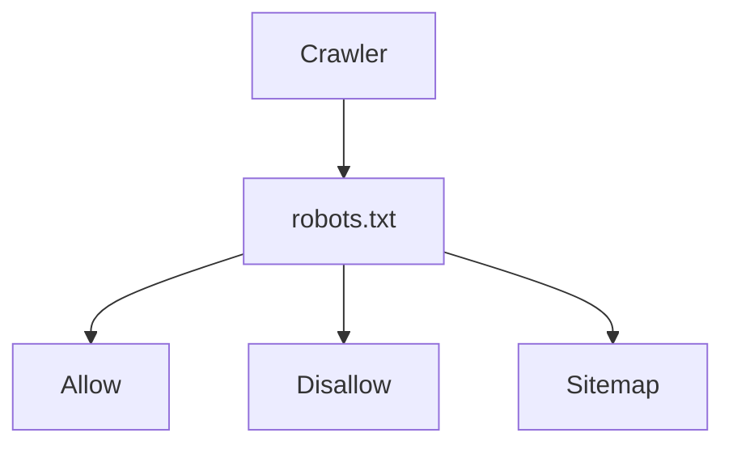

# Search Engine Crawling Process

## Overview

Crawling is the process by which search engines discover and retrieve publicly accessible web pages.

Search engines use automated programs, commonly called **crawlers**, **robots**, or **spiders**, to navigate websites by following links and processing XML Sitemaps.

Crawling is the first step in making content discoverable. However, a successfully crawled page is **not automatically indexed or ranked**.

---

# Complete Crawling Workflow


---

# Step 1 — Website Discovery

Search engines first need to discover a website.

Common discovery methods include:

- Internal links
- External backlinks
- XML Sitemap
- Manual submission through webmaster tools
- Previously indexed pages

Discovery helps search engines learn that new content exists.

---

# Step 2 — robots.txt

Before crawling, many crawlers check the website's robots.txt file.



The robots.txt file provides crawl guidance but is **not** a security mechanism.

---

# Step 3 — XML Sitemap

If available, crawlers may use the XML Sitemap as an additional source of URL discovery.

```mermaid
graph LR

XML Sitemap

--> Jobs

XML Sitemap

--> Results

XML Sitemap

--> Admit Cards

XML Sitemap

--> Syllabus

XML Sitemap

--> Categories
```

Sitemaps help organize discoverable URLs, particularly on large websites.

---

# Step 4 — Crawl Queue

Search engines maintain large queues of URLs waiting to be crawled.

Factors that may influence crawl scheduling include:

- Website popularity
- Internal links
- Content freshness
- Crawl history
- Server responsiveness

The exact algorithms vary by search engine.

---

# Step 5 — HTTP Request

The crawler requests a URL.

Example

```
GET /ssc-cgl-2026

HTTP/1.1
```

Possible responses include:

- 200 OK
- 301 Redirect
- 302 Redirect
- 404 Not Found
- 410 Gone
- 500 Server Error

Successful crawling depends on receiving a valid response.

---

# Step 6 — HTML Download

If the page is accessible, the crawler downloads the HTML.

Information collected may include:

- Page Title
- Meta Description
- Headings
- Canonical URL
- Structured Data
- Images
- Internal Links
- External Links

---

# Step 7 — Link Extraction

```mermaid
graph TD

Job Page

--> Related Jobs

Job Page

--> Admit Card

Job Page

--> Results

Job Page

--> Previous Papers

Job Page

--> Home
```

Extracted links help search engines discover additional pages.

Strong internal linking improves crawl efficiency.

---

# Step 8 — Metadata Extraction

Crawlers also analyze metadata.

Examples include:

- Meta Title
- Meta Description
- Canonical
- Robots Meta Tags
- Open Graph
- Structured Data

This information helps search engines understand page relationships and presentation.

---

# Step 9 — Resource Discovery

Modern pages often reference additional resources.

Examples include:

- CSS
- JavaScript
- Images
- Fonts
- Videos

Search engines may fetch these resources when rendering the page.

---

# Step 10 — Crawl Scheduling

After processing the page, search engines decide when it should be crawled again.

Factors may include:

- Content changes
- Server performance
- Publication frequency
- User demand

Frequently updated websites may be revisited more often.

---

# Crawl Budget

Large websites often discuss the concept of crawl budget.

In general, crawl efficiency can be improved by:

- Avoiding broken links
- Reducing duplicate pages
- Maintaining a logical site structure
- Providing XML Sitemaps
- Returning appropriate HTTP status codes

The importance of crawl budget depends on the size and complexity of the website.

---

# Crawling vs Indexing

These are different processes.

| Crawling | Indexing |
|----------|----------|
| Discovers pages | Evaluates pages for inclusion in the search index |
| Downloads content | Stores selected information for retrieval |
| May occur without indexing | Usually requires prior crawling (or equivalent discovery) |

A crawled page is not guaranteed to be indexed.

---

# Crawling Best Practices

Recommended practices include:

- Fast server response
- Stable website uptime
- Valid HTML
- Mobile-friendly pages
- Logical navigation
- XML Sitemap
- robots.txt
- Strong internal linking

---

# Common Crawling Problems

Avoid:

- Broken links
- Infinite URL parameters
- Redirect chains
- Slow server response
- Duplicate URLs
- Orphan pages
- Incorrect canonical tags
- Invalid robots.txt syntax

---

# Crawling Checklist

Before publishing:

- URL is accessible
- HTTP 200 response
- robots.txt reviewed
- XML Sitemap updated
- Internal links added
- Canonical URL configured
- Structured Data validated

After publishing:

- Verify crawl status in webmaster tools
- Monitor server logs (if available)
- Fix crawl errors promptly
- Keep important pages linked

---

# Related Documentation

- docs/robots.md
- docs/sitemap.md
- docs/seo.md
- docs/schema.md

---

# Conclusion

Crawling is the first stage of search engine discovery.

A well-structured website with clear navigation, useful internal links, a maintained XML Sitemap, and an appropriate robots.txt configuration makes it easier for search engines to discover content efficiently.

Understanding the crawling process helps website owners design websites that are easier to maintain, easier to navigate, and more accessible to both users and automated systems.