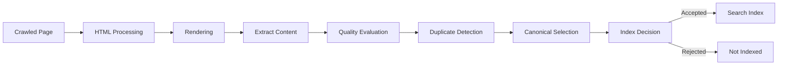
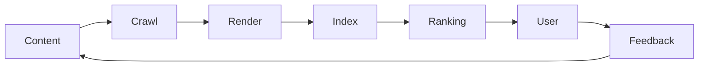

# Search Engine Indexing Process

## Overview

Indexing is the process by which a search engine evaluates, organizes, and stores information from crawled web pages so that it can be retrieved in search results.

Crawling discovers content.

Indexing decides whether that content should become part of the searchable index.

Not every crawled page is indexed.

---

# Complete Indexing Workflow



---

# Step 1 — Crawled Page

Indexing begins after a crawler successfully retrieves a page.

Typical requirements include:

- HTTP 200 response
- Accessible HTML
- Publicly available content
- Crawl permission

---

# Step 2 — HTML Processing

The search engine begins analyzing the downloaded HTML.

Typical elements include:

- Page Title
- Meta Description
- Headings
- Links
- Images
- Structured Data
- Canonical URL

---

# Step 3 — Rendering

Modern websites often depend on CSS and JavaScript.

Rendering helps search engines understand the final page users see.

```mermaid
graph LR

HTML

--> CSS

HTML

--> JavaScript

HTML

--> Images

CSS

--> Rendered Page

JavaScript

--> Rendered Page

Images

--> Rendered Page
```

Rendering allows search engines to evaluate visible content more accurately.

---

# Step 4 — Content Extraction

The rendered page is analyzed.

Search engines may extract:

- Visible text
- Headings
- Tables
- Lists
- Images
- Links
- Structured Data

This information helps determine what the page is about.

---

# Step 5 — Quality Evaluation

Search engines evaluate whether a page provides sufficient value.

General considerations may include:

- Original content
- Clear structure
- Readability
- Helpful information
- Freshness
- Technical health

Evaluation methods differ between search engines.

---

# Step 6 — Duplicate Detection

Search engines compare similar pages.

```mermaid
graph TD

Page A

Page B

Page C

--> Duplicate Detection

Duplicate Detection

--> Canonical Selection
```

If multiple pages contain substantially similar content, one version may be preferred.

---

# Step 7 — Canonical Selection

Canonicalization helps determine the preferred version of similar content.

Example:

```
https://example.com/jobs

https://www.example.com/jobs

https://example.com/jobs?ref=abc
```

A canonical URL helps communicate the preferred version.

---

# Step 8 — Index Decision

After evaluation, the search engine decides whether to include the page in its index.

Possible outcomes include:

- Indexed
- Delayed
- Re-evaluated later
- Not indexed

The decision is made by the search engine based on many signals.

---

# Indexed Content

```mermaid
graph TD

Indexed Page

--> Search Database

Search Database

--> Search Results
```

Once indexed, a page becomes eligible to appear in search results for relevant queries.

Indexing does not guarantee rankings.

---

# Factors That May Influence Indexing

Examples include:

- Crawl accessibility
- Technical quality
- Content uniqueness
- Canonical signals
- Internal linking
- XML Sitemap
- Structured Data
- Server reliability

No single factor guarantees indexing.

---

# Freshness

Search engines may revisit indexed pages over time.

Reasons include:

- Updated content
- New information
- Changed metadata
- Improved quality

Regular maintenance can help keep information current.

---

# Indexing vs Ranking

These processes are different.

| Indexing | Ranking |
|----------|----------|
| Determines whether a page is stored in the search index | Determines how relevant an indexed page may be for a search |
| Happens before ranking | Happens after indexing |
| Does not guarantee visibility | Depends on many ranking signals |

---

# Common Reasons a Page May Not Be Indexed

Examples include:

- Duplicate content
- Soft 404 pages
- Thin content
- Server errors
- Incorrect canonicalization
- Crawl issues
- Blocked resources
- Poor internal linking

The specific reasons vary depending on the search engine.

---

# Indexing Best Practices

Recommended practices include:

- Publish useful content
- Maintain clear navigation
- Use descriptive titles
- Add internal links
- Keep XML Sitemaps updated
- Validate structured data
- Return appropriate HTTP status codes

---

# Indexing Checklist

Before publishing:

- HTTP 200 response
- Canonical URL reviewed
- Metadata completed
- Internal links added
- XML Sitemap updated
- Structured Data validated
- Mobile rendering checked

After publishing:

- Monitor indexing status
- Update outdated content
- Fix crawl issues
- Improve content quality where needed

---

# Relationship with Other SEO Components



SEO is an ongoing cycle rather than a one-time process.

---

# Related Documentation

- docs/seo.md
- docs/schema.md
- docs/sitemap.md
- docs/robots.md
- diagrams/crawling-process.md

---

# Conclusion

Indexing is the bridge between crawling and search visibility.

Publishing a page does not automatically place it in a search engine's index. A combination of technical quality, useful content, crawlability, and ongoing maintenance helps search engines evaluate pages effectively.

Understanding indexing helps website owners create content that is easier to maintain, discover, and organize over time.