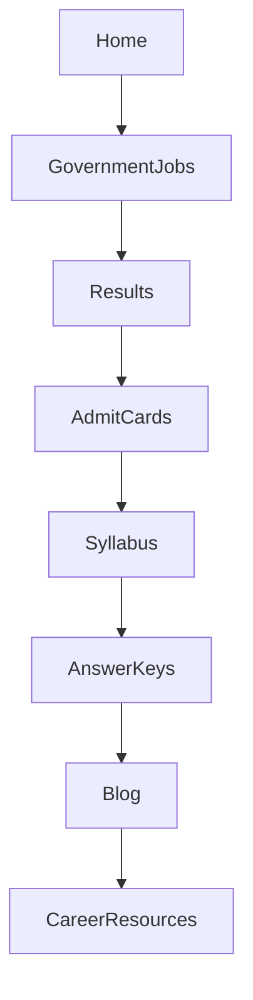
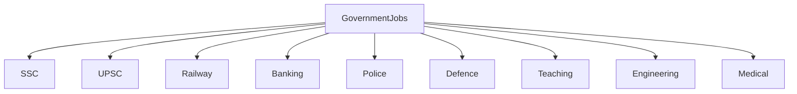
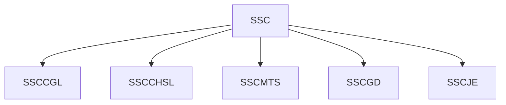
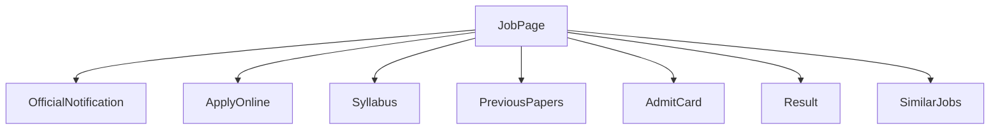
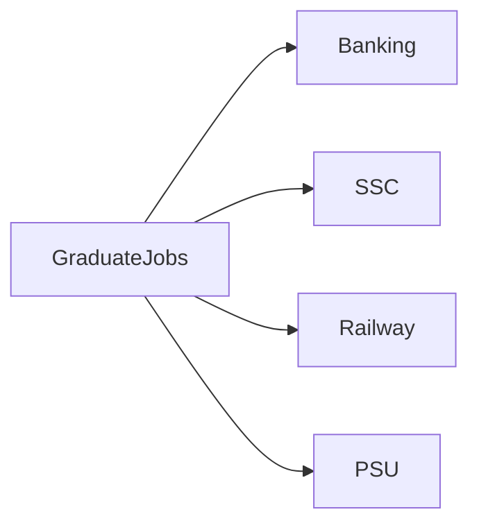
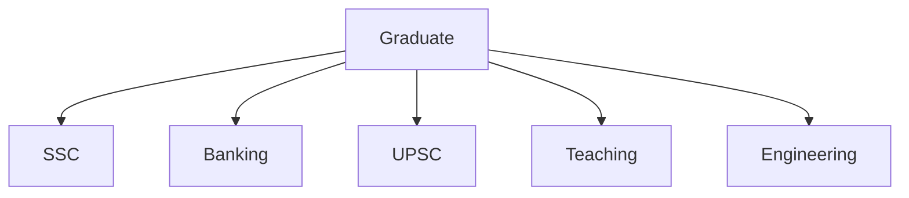
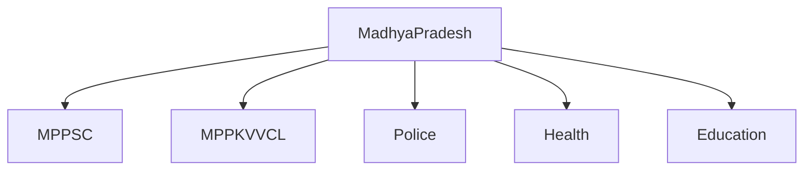
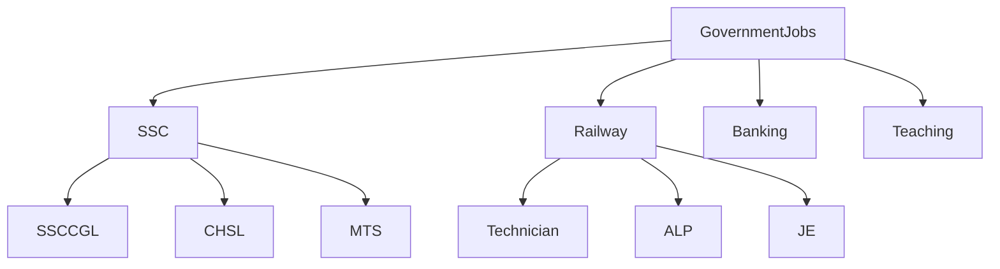

# Internal Linking Architecture

## Overview

Internal linking is the process of connecting related pages within the same website.

A well-designed internal linking strategy improves navigation, distributes authority throughout the website, and helps search engines understand how topics are related.

For content-rich websites like GovtJobNow, internal linking is an important part of both technical SEO and user experience.

---

# Why Internal Linking Matters

Effective internal linking helps:

- Discover new pages
- Improve navigation
- Establish topical relationships
- Reduce orphan pages
- Guide users toward related content
- Support large website architecture
- Improve crawl efficiency

---

# Website Topic Cluster



The homepage links to major topic clusters.

---

# Government Jobs Cluster



Each category becomes its own content hub.

---

# Category Structure



Every recruitment belongs to a parent category.

---

# Job Detail Linking

Every recruitment page should link to useful related resources.



This helps users continue their journey without unnecessary searching.

---

# Cross Category Linking

Some pages naturally relate to more than one category.

Example



Cross-linking should always be based on genuine topical relevance.

---

# Qualification-Based Linking

Educational qualification pages can connect users with relevant opportunities.



---

# State-Based Linking



Location pages provide another logical navigation path.

---

# User Journey


Good internal linking encourages users to explore related information naturally.

---

# Link Hierarchy

```
Home

↓

Category

↓

Sub Category

↓

Recruitment

↓

FAQ

↓

Related Recruitment

↓

Official Website
```

The hierarchy should be simple and consistent.

---

# Pillar and Cluster Model



Pillar pages introduce broad topics.

Cluster pages provide detailed information.

---

# Related Content Strategy

Every page should include links to relevant resources where appropriate.

Examples include:

- Similar recruitment notifications
- Previous papers
- Admit cards
- Results
- Exam syllabus
- Preparation guides
- Eligibility guides

These links should help users rather than simply increase link counts.

---

# Anchor Text Best Practices

Use descriptive anchor text.

Good examples:

- SSC CGL Eligibility
- Railway Recruitment 2026
- Download Official Notification
- Banking Jobs for Graduates

Avoid vague phrases such as:

- Click Here
- Read More
- Learn More

---

# Internal Linking Checklist

Before publishing:

- Link to parent category
- Link to homepage where appropriate
- Link to related jobs
- Link to syllabus
- Link to results
- Link to admit cards
- Link to official notification
- Check for broken links
- Use descriptive anchor text
- Avoid unnecessary repetition

---

# Common Mistakes

Avoid:

- Orphan pages
- Broken links
- Too many repetitive links
- Irrelevant cross-linking
- Generic anchor text
- Deep navigation
- Circular linking without value

---

# Maintenance

Internal links should be reviewed regularly.

Examples:

- Remove expired links
- Replace broken URLs
- Add links to newly published resources
- Update category pages
- Refresh related job suggestions

Regular maintenance helps keep the website organized.

---

# Relationship with SEO

Internal linking supports:

- Crawlability
- Website architecture
- Topic clusters
- User navigation
- Content discovery
- Search engine understanding

It complements technical SEO, structured data, XML Sitemaps, and high-quality content.

---

# Related Documentation

- docs/seo.md
- docs/geo.md
- docs/aeo.md
- docs/sitemap.md
- diagrams/website-architecture.md
- diagrams/crawling-process.md
- diagrams/indexing-process.md

---

# Conclusion

Internal linking is one of the most effective ways to improve the usability and organization of a content-rich website.

Rather than adding links solely for SEO purposes, links should guide users toward genuinely helpful information and create a logical relationship between related topics.