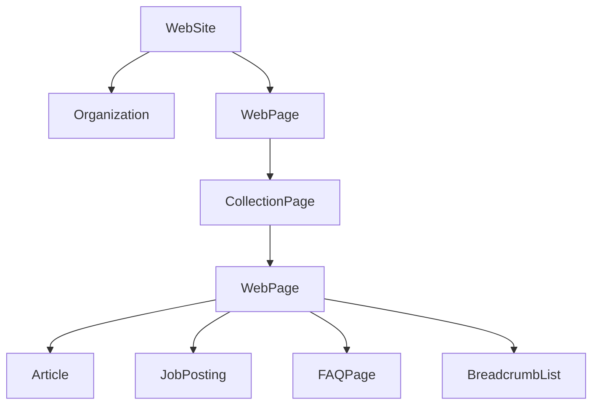
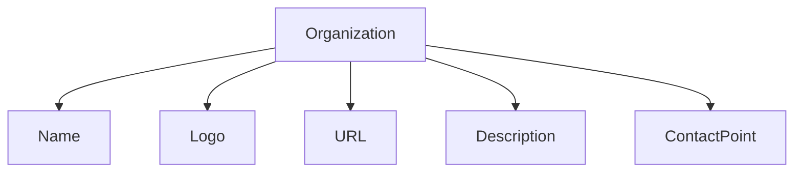
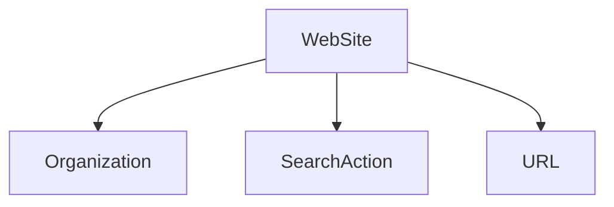
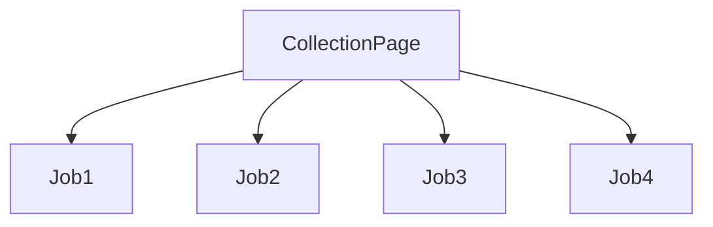
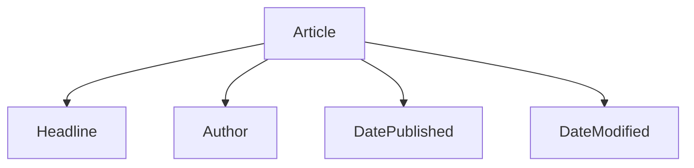
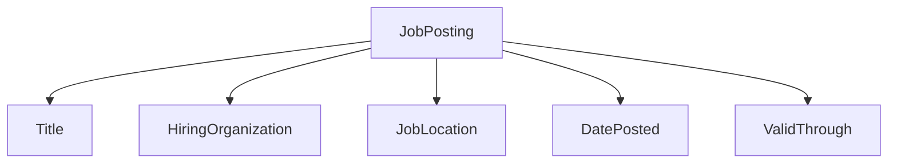
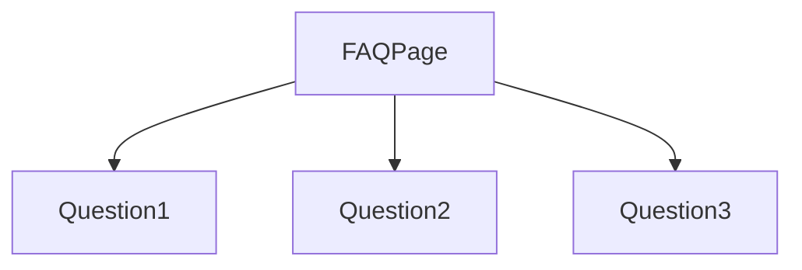
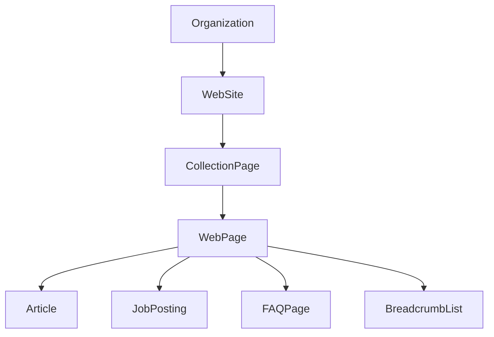

# Schema.org Architecture

## Overview

Structured data helps search engines understand the meaning and relationships of content published on a website.

Instead of relying only on visible text, structured data provides machine-readable information that describes organizations, webpages, articles, FAQs, breadcrumbs, job postings, and many other entities.

GovtJobNow uses structured data to improve content organization and provide additional context to search engines.

> **Important:** Different page types require different Schema.org types. Not every schema belongs on every page.

---

# Overall Schema Architecture



This architecture shows how different structured data types relate to different sections of the website.

---

# Organization Schema

The Organization schema identifies the publisher of the website.

Typical properties include:

- Name
- URL
- Logo
- Description
- Contact Information
- Social Profiles (when applicable)



Generally, this schema is used site-wide to identify the organization behind the website.

---

# WebSite Schema

The WebSite schema describes the overall website rather than an individual page.

Typical properties include:

- Website Name
- URL
- Publisher
- SearchAction (if supported)



---

# BreadcrumbList Schema

Breadcrumbs communicate page hierarchy.

Example hierarchy:

```mermaid
graph LR

Home

--> Government Jobs

--> SSC Jobs

--> SSC CGL Notification
```

Breadcrumbs help both users and search engines understand navigation paths.

---

# CollectionPage Schema

Category pages often represent collections of related resources.

Examples include:

- Railway Jobs
- Banking Jobs
- SSC Jobs
- UPSC Jobs



---

# Article Schema

Recruitment pages often contain editorial explanations.

Examples include:

- Eligibility
- Selection Process
- Salary
- Application Process



Article schema describes editorial content, not the recruitment itself.

---

# JobPosting Schema

Where appropriate and applicable, JobPosting schema can describe an individual job opportunity.

Typical properties include:

- Job Title
- Hiring Organization
- Employment Type
- Job Location
- Date Posted
- Valid Through



Use JobPosting only when the page genuinely represents a specific job opportunity.

---

# FAQPage Schema

FAQPage schema represents frequently asked questions that are visible on the page.



Questions and answers should match the visible page content.

---

# Relationship Between Schemas



This illustrates how different schema types complement one another rather than replace one another.

---

# Schema Selection by Page Type

| Page Type | Common Schema Types |
|------------|---------------------|
| Home Page | WebSite, Organization |
| Category Page | CollectionPage, BreadcrumbList |
| Recruitment Article | Article, BreadcrumbList |
| Job Detail | JobPosting (where appropriate), Article, BreadcrumbList |
| FAQ Page | FAQPage |
| Blog Article | Article, BreadcrumbList |

The exact schema used depends on the content of the page.

---

# Schema Validation

Before deployment:

- Validate JSON-LD syntax.
- Ensure required properties are present where applicable.
- Match structured data to visible page content.
- Avoid adding schema for information that users cannot see.
- Review implementation after significant page updates.

Validation tools and documentation from Schema.org and search engines can help verify implementations.

---

# Common Mistakes

Avoid:

- Invalid JSON syntax
- Missing required properties
- Incorrect page type
- Duplicate structured data
- Hidden FAQ content
- Misusing JobPosting schema
- Outdated structured data

---

# Schema Implementation Workflow

```mermaid
flowchart LR

Create Page

--> Select Schema

--> Generate JSON-LD

--> Validate

--> Publish

--> Monitor

--> Update
```

---

# Best Practices

A good structured data implementation should:

- Reflect visible content
- Be maintained over time
- Use appropriate schema types
- Follow Schema.org vocabulary
- Be validated before deployment

Structured data is intended to improve understanding—not to replace high-quality content.

---

# Related Documentation

- docs/schema.md
- docs/seo.md
- docs/geo.md
- examples/Organization.json
- examples/WebSite.json
- examples/JobPosting.json
- examples/FAQPage.json
- examples/Breadcrumb.json

---

# Conclusion

Structured data helps describe the meaning of a page in a standardized, machine-readable format.

When implemented accurately and maintained consistently, it complements technical SEO by improving how search engines interpret content and relationships across a website.