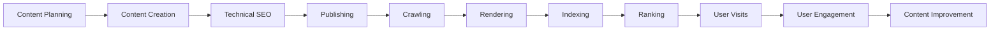
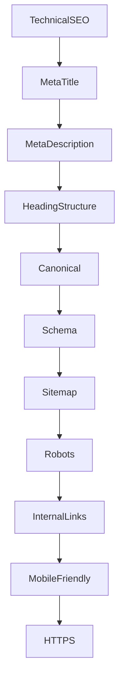
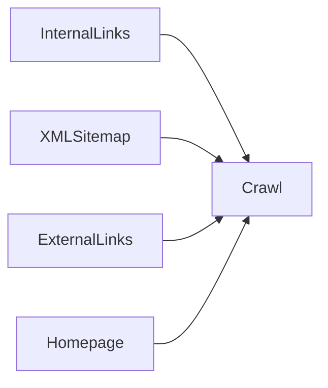
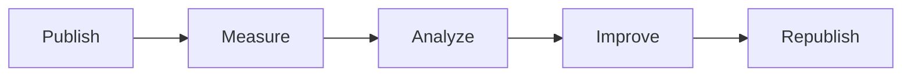
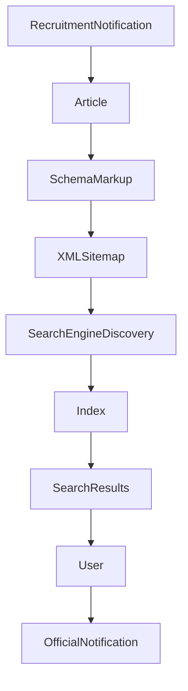

# SEO Flow Architecture

## Overview

Search Engine Optimization (SEO) is an ongoing process that helps search engines discover, understand, and present useful content to users.

Rather than being a single action, SEO is a workflow that combines content creation, technical implementation, user experience, and continuous improvement.

This document illustrates a high-level SEO workflow suitable for educational and Government Recruitment websites.

---

# Complete SEO Workflow



SEO is iterative. User feedback and content updates help improve the website over time.

---

# Content Planning

Every successful page begins with planning.

Typical planning activities include:

- Identifying user needs
- Understanding search intent
- Choosing the appropriate page type
- Organizing related topics
- Planning internal links

For GovtJobNow, examples include:

- Recruitment Notifications
- Admit Cards
- Results
- Syllabus
- Government Schemes

---

# Content Creation

Once a topic has been selected, create content that is:

- Accurate
- Helpful
- Well-structured
- Easy to scan
- Regularly updated

Example structure:

```text
Title

Overview

Important Dates

Eligibility

Vacancy

Salary

Selection Process

Application Process

FAQs
```

---

# Technical SEO

Before publishing, technical checks should be completed.



Technical SEO helps search engines interpret and crawl content more effectively.

---

# Publishing

After quality checks, the page is published.

Recommended post-publication tasks:

- Verify links
- Validate structured data
- Update XML Sitemap
- Confirm canonical URL
- Check mobile rendering
- Test page performance

---

# Search Engine Discovery

Search engines first need to discover the page.

Typical discovery methods include:



The more clearly a page is connected to the rest of the site, the easier it is to discover.

---

# Crawling

During crawling, automated systems request the page and collect its content.

They may evaluate:

- HTML
- Links
- Metadata
- Structured Data
- Images
- Page status

A successful crawl does not guarantee indexing.

---

# Rendering

Many modern pages include JavaScript.

Rendering allows search engines to process the final page as users would see it.

Rendering may include:

- Navigation
- Dynamic content
- Images
- Structured Data
- CSS

---

# Indexing

If a page is considered suitable, it may be added to a search engine's index.

Factors that can influence indexing include:

- Accessibility
- Content quality
- Duplicate content
- Canonical signals
- Crawlability
- Technical health

Indexing decisions are made by search engines.

---

# Ranking

When users perform searches, indexed pages may be evaluated based on many signals.

Examples include:

- Relevance
- Content quality
- Freshness
- Page experience
- Authority
- Search intent

There is no single factor that determines rankings.

---

# User Experience

SEO continues after users arrive.

Important considerations include:

- Fast loading
- Clear navigation
- Helpful content
- Readable formatting
- Mobile usability
- Accessibility

A positive experience encourages users to continue exploring the website.

---

# Continuous Improvement

SEO is not a one-time task.



Typical improvements include:

- Updating outdated information
- Expanding FAQs
- Improving readability
- Fixing broken links
- Refreshing metadata
- Adding internal links

---

# SEO Flow for GovtJobNow



The objective is to help users reach official recruitment information efficiently.

---

# Best Practices

A sustainable SEO workflow includes:

- Publishing accurate information
- Referencing official sources
- Maintaining a logical site structure
- Updating content when official notifications change
- Monitoring technical health
- Reviewing internal links
- Keeping structured data accurate

---

# Common Mistakes

Avoid:

- Publishing incomplete pages
- Duplicate content
- Broken internal links
- Missing metadata
- Invalid structured data
- Poor mobile experience
- Outdated recruitment information

---

# SEO Workflow Checklist

Before publishing:

- Content reviewed
- Metadata completed
- Headings organized
- Images optimized
- Structured data validated
- Internal links added
- XML Sitemap updated
- Mobile tested
- Accessibility reviewed

After publishing:

- Verify indexing status
- Monitor broken links
- Update when official information changes
- Improve FAQs based on user questions

---

# Related Documentation

- `docs/seo.md`
- `docs/geo.md`
- `docs/aeo.md`
- `docs/schema.md`
- `docs/sitemap.md`
- `docs/robots.md`

---

# Conclusion

SEO is an ongoing process of publishing useful information, maintaining technical quality, and improving the user experience.

Rather than focusing on individual ranking factors, a successful strategy combines high-quality content, sound technical practices, and continuous maintenance over time.