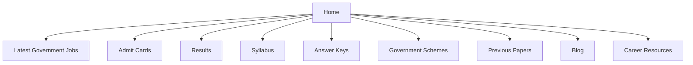
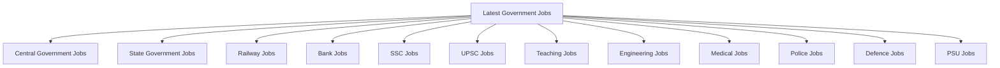
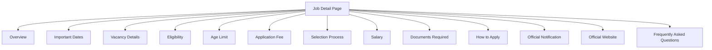
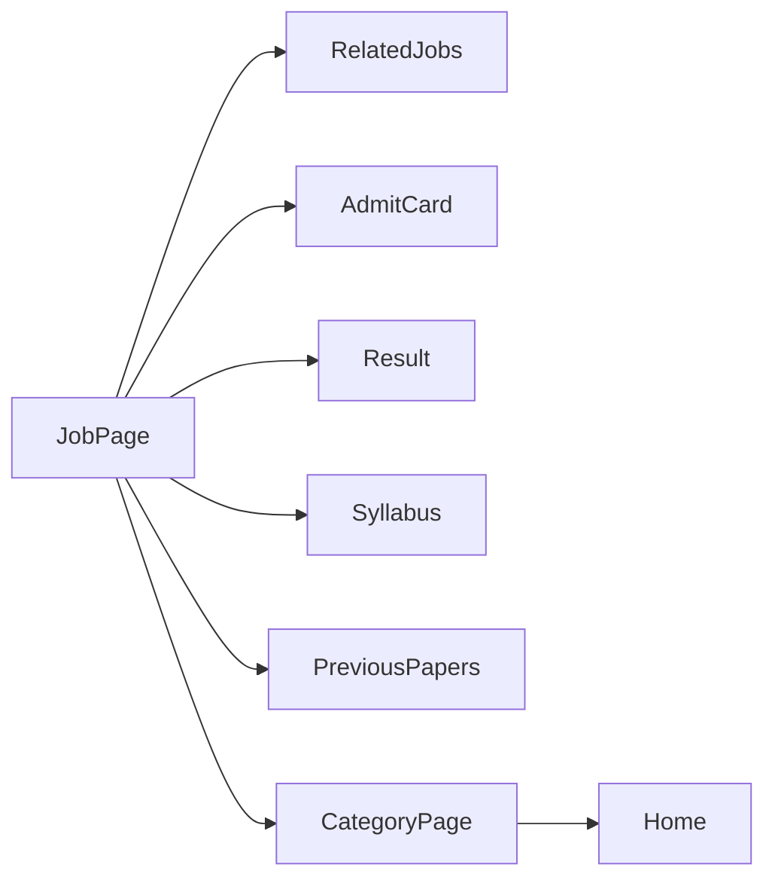
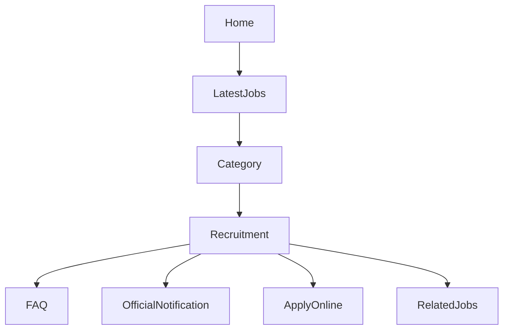

# Website Architecture

## Overview

A well-structured website architecture is the foundation of technical SEO, user experience, crawlability, and AI readability.

For content-heavy websites like GovtJobNow, a clear hierarchy helps:

- Users find information quickly.
- Search engines discover and understand pages efficiently.
- AI systems identify relationships between topics.
- Internal links distribute authority naturally.
- New content gets discovered faster.

This document illustrates a scalable architecture suitable for a Government Jobs portal and similar educational websites.

---

# High-Level Website Structure



---

# Category Architecture

Each major section should contain logical child categories.



This hierarchy allows users and crawlers to navigate from broad topics to specific recruitment pages.

---

# Job Detail Architecture

Every recruitment page should follow a consistent structure.



A predictable layout improves readability and helps visitors quickly locate important information.

---

# Internal Linking Architecture

Internal links connect related content and improve navigation.



Good internal linking helps users continue their journey and gives search engines additional context.

---

# Website Content Hierarchy



The structure should move from general information to specific resources.

---

# Navigation Principles

A strong navigation system should:

- Keep important sections within a few clicks of the homepage.
- Use descriptive menu labels.
- Group related topics together.
- Maintain consistent navigation across devices.
- Highlight frequently used sections.

---

# URL Hierarchy

Example URL structure:

```
/

/latest-government-jobs/

/ssc/

/ssc/ssc-cgl-2026/

/railway/

/railway/rrb-technician-2026/

/results/

/admit-card/

/syllabus/

/government-schemes/
```

Readable URLs improve usability and help communicate page purpose.

---

# Breadcrumb Structure

```mermaid
graph LR

Home

--> SSC Jobs

--> SSC CGL

--> Notification
```

Breadcrumbs help users understand where they are within the website hierarchy.

---

# Information Flow

A typical user journey may look like this:

```mermaid
graph LR

Google

--> Category Page

--> Job Detail

--> Apply Online

--> Official Website
```

Supporting related resources (such as syllabus or previous papers) can extend the user's journey naturally.

---

# Recommended Architecture Principles

A scalable architecture should aim to:

- Organize content by topic.
- Minimize duplicate pages.
- Keep navigation intuitive.
- Use consistent page templates.
- Support internal linking.
- Make important content easy to discover.

---

# Common Architecture Mistakes

Avoid:

- Deep navigation requiring many clicks.
- Duplicate category structures.
- Orphan pages with no internal links.
- Generic page titles.
- Confusing URL patterns.
- Broken navigation paths.
- Excessively nested menus.

---

# Scalability

As the website grows, additional sections can be added without changing the overall structure.

Examples include:

- Interview Preparation
- Current Affairs
- Exam Calendar
- Mock Tests
- Cut-Off Analysis
- Career Guidance
- Government Internship Opportunities

This allows the information architecture to evolve while remaining consistent.

---

# Architecture Checklist

Before launching a new section:

- Clear category placement
- Logical URL structure
- Internal links added
- Breadcrumbs implemented
- Navigation updated
- Related content connected
- Mobile navigation verified
- Search functionality tested

---

# Conclusion

Website architecture is not only about organizing pages—it is about creating a structure that supports users, search engines, and future growth.

A consistent hierarchy, meaningful internal links, and clear navigation make it easier to maintain large educational websites and improve the overall experience for everyone.
